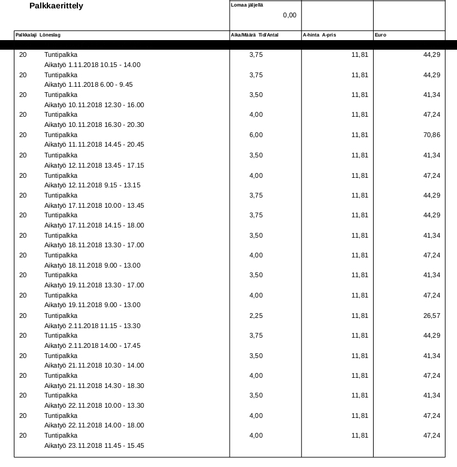
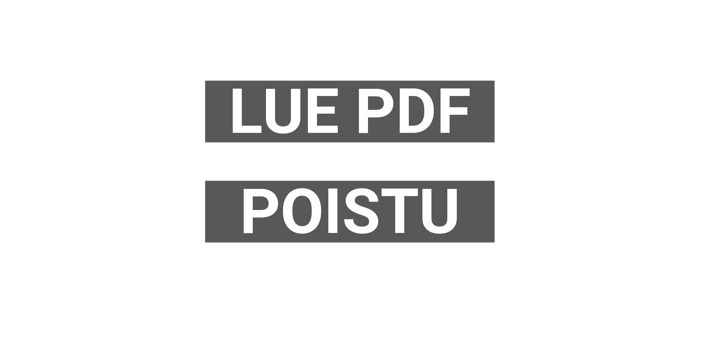

# Palkantarkastaja
Lukee staffpointin palkkalaskelman pdf:stä ja näyttää sen ihmiselle ymmärrettävässä muodossa [kivy](https://kivy.org) pohjaisessa käyttöliittymässä.

Slipreader.py käyttää [tabula-py:ta](https://pypi.org/project/tabula-py/) lukeakseen pdf tiedoston numpy dataframeen josta pomitaan tiedot ja ne tallennetaan jsoniin. Tämän jälkeen main.py lukee jsonin ja jakaa lisät suoraan päivän mukaan joten on helppo nähdä jokaisen päivän palkan ja lisät sekä koko kuukauden palkka. Alimmalla rivillä käyttöliittymässä on palkkaelementit jotka on maksettu muilta kuin kyseisen kuukauden päiviltä, sekä elementit joiden rivillä palkkalaskelmassa ei ole lainkaan päivämäärää. Päivän klikkaaminen avaa "päivänäkymän" joka näyttää eroteltuna lisät niin kuin ne on ilmoitettuna varsinaisessa palkkalaskelmassa.

